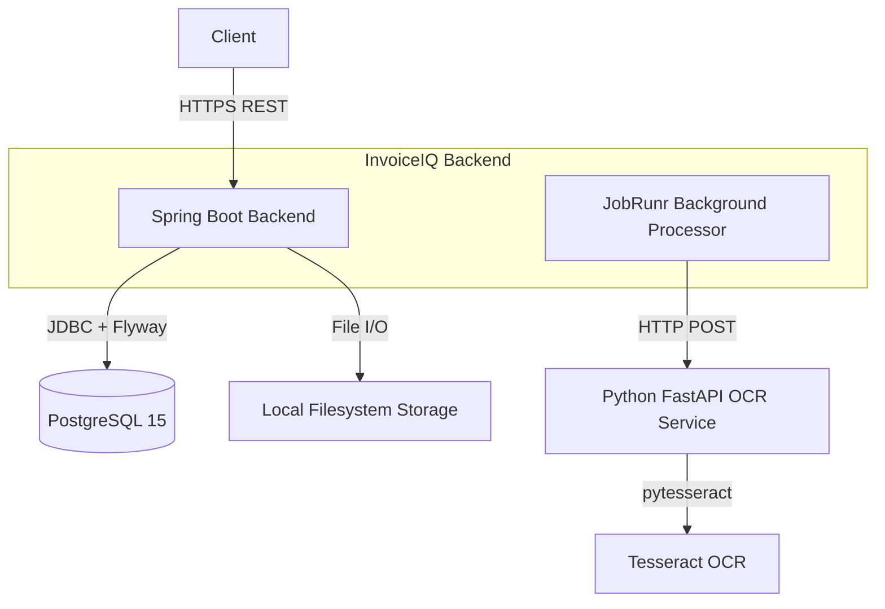

# InvoiceIQ

Multi-tenant invoice automation platform — Spring Boot backend with JWT/RBAC, PostgreSQL, Flyway, a FastAPI/Tesseract OCR sidecar, JobRunr background processing, and concurrency-safe approval workflows.

## Overview

Manual invoice processing is slow, error-prone, and hard to audit across organizational hierarchies. InvoiceIQ centralizes it: vendors and invoices with line items, document upload with OCR extraction, idempotent creation, optimistic-locked updates, a rule-driven approval workflow, and an audit trail — with strict per-tenant data isolation throughout.

## Key Features (all implemented and tested)

- **Java 21 / Spring Boot 3.3.4** modular monolith (`auth`, `tenant`, `invoice`, `vendor`, `document`, `workflow`, `audit`, `notification`, `common`)
- **Multi-tenancy**: shared-schema logical isolation; tenant bound from verified JWT claims into a `ThreadLocal`, cleared per request, plus a fail-closed Hibernate filter and tenant-scoped repository queries
- **JWT authentication**: short-lived access tokens + SHA-256-hashed, rotating refresh tokens; `token_type` separation so refresh tokens can't access the API
- **RBAC**: `ADMIN` / `APPROVER` / `SUBMITTER` enforced at controller and service level; 401 vs 403 semantics
- **Invoice management**: CRUD with line items, server-computed totals (`BigDecimal` / `NUMERIC(19,4)`), DRAFT → NEEDS_REVIEW → PENDING_APPROVAL → APPROVED / REJECTED
- **OCR processing**: FastAPI + Tesseract sidecar; deterministic regex/Decimal extraction with per-field heuristic confidence
- **Approval workflow**: tenant-scoped rules (amount/currency/priority), sequential approval steps, approve/reject with 409 conflict semantics
- **Audit trail**: state-transition events recorded in the same transaction (convention-based, not DB-enforced immutability)
- **PostgreSQL 15 + Flyway** (V1–V6, validated against real Postgres in tests)
- **Idempotency**: `X-Idempotency-Key` with payload-hash conflict detection + partial unique index
- **Optimistic locking**: `@Version` + explicit version checks → HTTP 409 on races
- **Upload security**: type/size/filename validation, basename sanitization, storage containment checks
- **Docker Compose** for PostgreSQL, Redis, the OCR service, and the Spring Boot backend container
- **Tests**: 48 Java integration tests + 6 Python tests, green, zero skipped

## Architecture



Notes: the backend itself runs as a Docker container (`Dockerfile` + Compose `backend` service on :8080, `docker` Spring profile, healthy-dependency on PostgreSQL and OCR, runs the JobRunr background server). **JobRunr persists jobs in PostgreSQL** (Spring Boot auto-configuration), not Redis — Redis ships in Compose but is currently unused by business logic and reserved for future caching/rate-limiting. Storage is `STORAGE_TYPE=local` (local filesystem) for development; the S3 abstraction is implemented and code-reviewed, but live S3 integration testing remains part of M7 and is not yet verified.

## Invoice Lifecycle

```
DRAFT → NEEDS_REVIEW → PENDING_APPROVAL → APPROVED
   \\         \\               └──→ REJECTED
    \\         └── (no matching rule → auto-APPROVED)
     └── created via POST /api/invoices (totals computed server-side)
```

- `DRAFT`: created via `POST /api/invoices` (line items required; totals derived, never trusted from the client).
- Documents may be uploaded to `DRAFT`/`REJECTED` invoices; extraction runs in a JobRunr worker and writes back draft fields.
- `POST /api/invoices/{id}/submit` (owner submitter or ADMIN): `DRAFT → NEEDS_REVIEW`, `SUBMITTED` audit event.
- `POST /api/invoices/{id}/workflow/initiate`: rule match → `PENDING_APPROVAL` + steps; no match → auto-`APPROVED`.
- `POST …/approval/approve` / `…/reject` (APPROVER/ADMIN): terminal `APPROVED` / `REJECTED`; repeat or stale-version actions → `409`.

## OCR Pipeline

Upload (`multipart/form-data`, PDF/PNG/JPG ≤ 10 MB, non-empty) → extension + containment-validated write under `data/storage/<tenantId>/` → SHA-256 checksum → document row (`UPLOADED`) → JobRunr job enqueued **after commit** → worker claims the document atomically (stale-lease reclaim after 5 min), calls FastAPI outside any DB transaction (5 s connect / 60 s read timeouts), persists `ExtractionResult` (`COMPLETED`/`FAILED`) and draft invoice fields. Success paths write decimal-string amounts parsed into `BigDecimal`; malformed values are ignored, never written.

## Security

- BCrypt password hashing; login requires `email` + `password` + `tenantId` (same email can exist in two tenants).
- Access (24 h default) vs refresh (7 d) JWTs with `token_type` enforcement; refresh tokens stored hashed, revoked on rotation, reuse rejected.
- Tenant identity comes only from the verified JWT + DB row match; `TenantContextFilter` only ever *clears* context; spoofed tenant headers change nothing.
- Uploads: allowlist, size cap, basename sanitization, storage containment on write and read.

## Concurrency & Reliability

- `@Version` on `Invoice`, `WorkflowInstance`, `ApprovalStep`, `Document`, `ExtractionResult` plus explicit expected-version checks → `409 Conflict` (never silent overwrite).
- `(tenant_id, vendor_id, invoice_number)` uniqueness + `(tenant_id, idempotency_key)` partial unique index back the application-level checks, so races collapse to 409s (proven by latch-raced tests).
- Extraction uses an atomic conditional-UPDATE claim; transient 5xx/timeouts rethrow for JobRunr retry, deterministic failures go terminal.

## Approval Workflow

Submit → initiate (rule match on amount/currency/priority) → sequential steps → approve/reject with actor, timestamp, comment, audit event, and submitter notification record. Terminal workflows reject further actions with 409.

## Auditability

`SUBMITTED`, `WORKFLOW_CREATED`, `AUTO_APPROVE`, `STEP_APPROVED`, `APPROVED`, `REJECTED` events (actor, entity, old/new state, comment, timestamp) written in the same transaction as the state change. Read via `GET /api/invoices/{invoiceId}/audit` (tenant-scoped, invoice-membership enforced). No delete/update API exists for audit rows.

## Technology Stack

| Layer | Technology |
|---|---|
| Backend | Java 21, Spring Boot 3.3.4, Spring Data JPA/Hibernate, Spring Security |
| Database | PostgreSQL 15 (H2 for fast unit tests) |
| Migrations | Flyway (V1–V6) |
| AI/OCR service | Python 3.11, FastAPI, Tesseract OCR, PyMuPDF, Pillow |
| Background processing | JobRunr (PostgreSQL-backed) |
| Auth | JWT (jjwt), BCrypt |
| API docs | SpringDoc OpenAPI (`/swagger-ui.html`) |
| Testing | JUnit 5, MockMvc, Testcontainers, pytest |
| Infra | Docker, Docker Compose |

## Project Structure

```
src/main/java/com/invoiceiq/
  auth/          login, JWT, refresh rotation, RBAC config
  tenant/        TenantContext, cleanup filter, tenant-filter aspect
  invoice/       CRUD, submit, idempotency, pagination/sort guards
  vendor/        supplier entities
  document/      upload, storage, JobRunr extraction worker, OCR client
  workflow/      rules, instances, approval steps, state transitions
  audit/         event recording + scoped read API
  notification/  persisted IN_APP records, sync-after-commit delivery
  common/        entities, 401/403/404/409 error contract
src/main/resources/db/migration/   V1–V6 Flyway SQL
python-ocr/      FastAPI app, Dockerfile (installs tesseract-ocr), pytest suite
```

## Getting Started

Prerequisites: Java 21, Maven wrapper included, Docker + Compose, Python 3.11 (only for running the OCR service/tests locally).

```bash
docker compose up -d --build                    # full stack: postgres :5432, redis :6379, python-ocr :8000, backend :8080
docker compose up -d postgres redis python-ocr  # infrastructure + OCR only (local backend dev)
docker compose up -d --build backend            # backend container only (needs healthy postgres + python-ocr)
./mvnw.cmd clean verify         # full Java suite (needs Docker for PG/OCR tests)
cd python-ocr && python -m pytest   # Python suite (needs tesseract binary for 1 test)
./mvnw.cmd spring-boot:run -Dspring-boot.run.profiles=local   # API on :8080
```

There is no self-registration endpoint; seed users directly in the database (see `docs/DEMO.md`).

## Environment Variables

```bash
JWT_SECRET_KEY=<your-base64-hs256-secret>   # required, no default
AI_SERVICE_TOKEN=<shared-java-python-token> # must match on both sides
AI_SERVICE_URL=http://python-ocr:8000       # docker profile (backend → OCR); code default http://localhost:8000 for local runs
OCR_CONNECT_TIMEOUT=5                       # docker profile (seconds)
OCR_READ_TIMEOUT=120                        # docker profile (seconds)
STORAGE_TYPE=local                           # local | s3 (S3 abstraction exists; live S3 verification is M7)
STORAGE_LOCAL_DIR=./data/storage            # host path; container default /app/data/storage under docker profile
S3_BUCKET / S3_REGION / S3_ACCESS_KEY / S3_SECRET_KEY / S3_ENDPOINT  # only used when STORAGE_TYPE=s3
POSTGRES_USER / POSTGRES_PASSWORD / POSTGRES_DB  # Compose / docker profile (POSTGRES_URL is composed as jdbc:postgresql://postgres:5432/<db>)
```

Test-only values live under `src/test/resources` and never authenticate production. Never commit real secrets — see `docs/GITHUB_SETUP.md`.

## API Overview

- `POST /api/auth/login` → `{accessToken, refreshToken}`; `POST /api/auth/refresh` → rotated pair
- `POST /api/invoices` (201 new / 200 idempotent replay), `GET /api/invoices` (paged, capped, whitelisted sort), `GET /api/invoices/{id}`, `PUT /api/invoices/{id}`, `POST /api/invoices/{id}/submit`, `DELETE /api/invoices/{id}` (ADMIN)
- `POST /api/invoices/{invoiceId}/documents` (202), `GET …/{documentId}`, `GET …/{documentId}/extraction`
- `POST /api/invoices/{invoiceId}/workflow/initiate`, `GET …/workflow`, `POST …/approval/approve`, `POST …/approval/reject`
- `POST/GET/PUT/DELETE /api/workflow-rules` (ADMIN), `GET /api/invoices/{invoiceId}/audit`
- Errors: 400 validation, 401 unauthenticated, 403 forbidden, 404 cross-tenant-or-missing, 409 conflicts — all in a uniform `ApiError` envelope. Full reference: `docs/API.md`.

## Testing

Verified evidence: **48 Java tests, 0 failures, 0 errors, 0 skipped** (`clean verify`, Docker available) + **6 Python tests green**. Coverage includes auth/RBAC, tenant isolation incl. spoofed headers, duplicate/idempotency matrices, latch-raced concurrency (invoice + approval), optimistic locking, traversal/validation, containerized real-OCR end-to-end, and Flyway-on-Postgres validation. Docker-dependent tests require Docker — M6.1 removed `@Testcontainers(disabledWithoutDocker = true)`, so they no longer silently skip when Docker is unavailable.

## Engineering Decisions

See `docs/ARCHITECTURE.md`, `docs/ENGINEERING_DECISIONS.md`, `docs/API.md`, `docs/DEMO.md`.

## Known Limitations

- Local filesystem storage for development (`STORAGE_TYPE=local`); S3 storage is implemented and deployment-ready, but live S3 integration testing remains part of M7 (not yet verified). No MinIO service in the current Compose stack.
- Backend runs as a Docker container (`Dockerfile` + Compose `backend` service) as well as via `spring-boot:run`.
- Notifications are persisted records with sync-after-commit simulated delivery — no SMTP/Slack dispatch.
- OCR extracts header fields and totals (regex heuristics + fixed confidence weights), not line items; no ML training.
- Single-instance JobRunr against Postgres; Redis reserved, not wired.
- Audit immutability is by convention (no mutating endpoints), not DB-enforced.
- Uncommitted local extras (`data/`, logs) are git-ignored runtime artifacts, not part of the build.

## Future Improvements

Live S3 integration verification, real notification dispatch, line-item extraction, composite tenant FKs, rate limiting, CI pipeline, approval SLA/escalation. All explicitly out of V1.0 scope. Cloud deployment has not happened yet; see `docs/DEPLOYMENT.md` for the planned M7 target (Railway + AWS S3).
