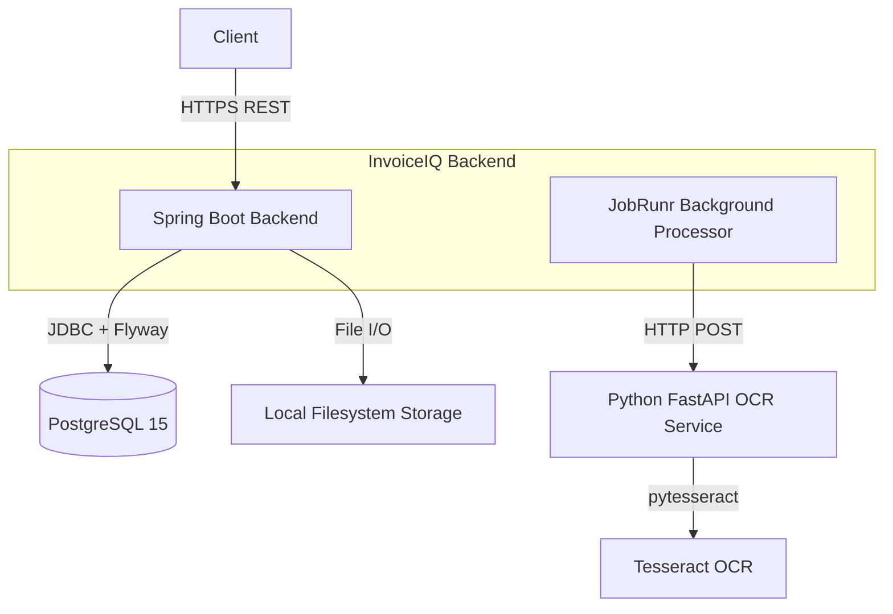
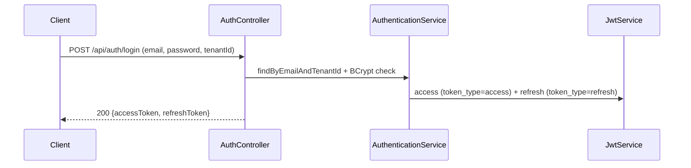
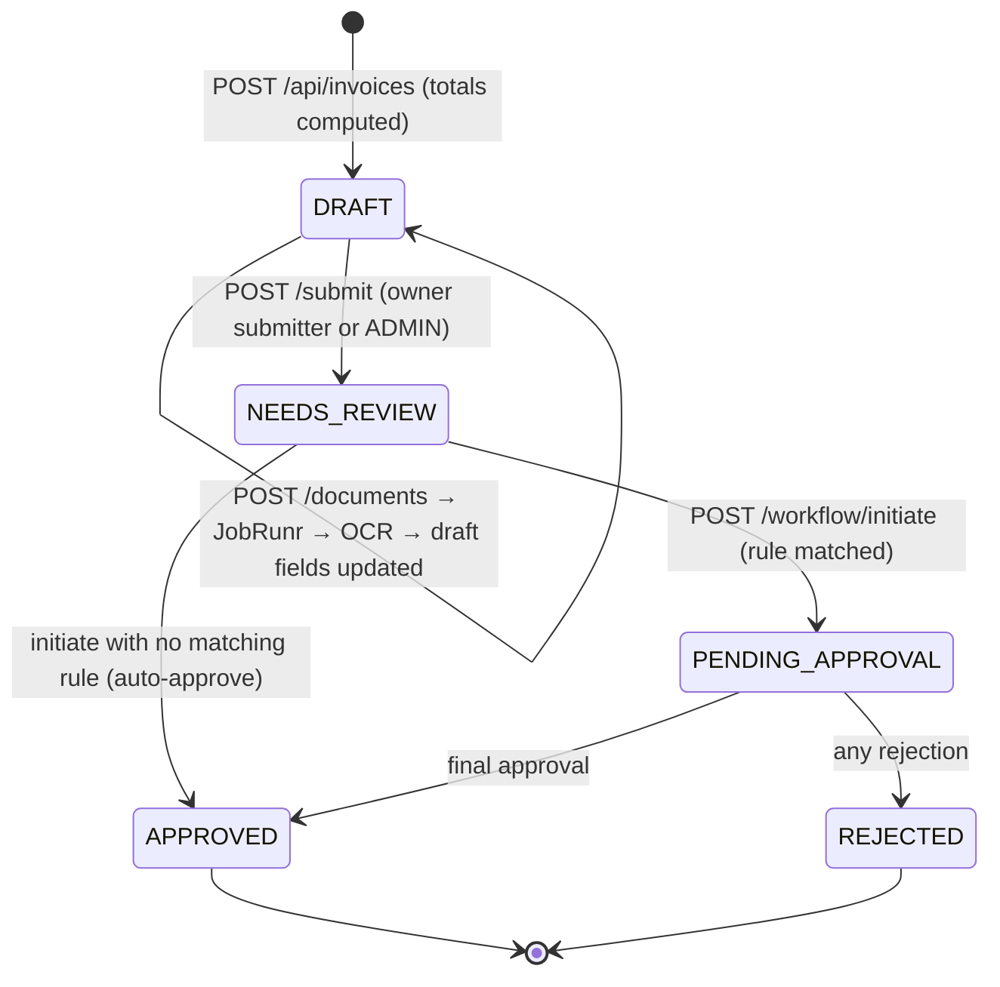

# InvoiceIQ Architecture

Current-state description of the implemented system. Nothing below describes planned features as built.

## High-Level Architecture

Modular monolith (single Spring Boot deployment) plus one stateless Python sidecar for OCR. No message bus, no microservices, no orchestrator beyond JobRunr.

Both services are containerized (backend `Dockerfile`, OCR `python-ocr/Dockerfile`); Compose runs PostgreSQL, Redis, the OCR service, and the Spring Boot backend. Redis ships in Compose but **no application code uses it**; JobRunr persists jobs in **PostgreSQL** via Spring Boot auto-configuration. Storage defaults to the local filesystem (`STORAGE_TYPE=local`); the S3 abstraction is implemented and verified live on AWS S3 in M7. Railway/AWS deployment is live (see `docs/DEPLOYMENT.md`).

## Component Responsibilities

1. **Spring Boot backend**: REST APIs, RBAC, tenant isolation, invoice/vendor CRUD, workflow state machine, audit + notification records, file storage, JobRunr coordination.
2. **Python FastAPI OCR (`python-ocr`)**: single `/extract` endpoint (multipart file → Tesseract → regex/Decimal field parsing → Pydantic response) plus `/health`. Stateless; enforces a shared bearer token from `AI_SERVICE_TOKEN`.
3. **PostgreSQL 15**: tenants, users, invoices, documents, extraction results, workflow, audit, notifications, refresh tokens, JobRunr tables. Unique constraints back idempotency and duplicate protection.
4. **JobRunr**: embedded in the Spring Boot runtime (dashboard disabled). Runs extraction jobs with tenant context set/cleared per execution.
5. **Local storage**: `data/storage/<tenantId>/<uuid>_<basename>`; containment-checked on write and read.

## Authentication Flow

Login is tenant-scoped because the same email may exist in two tenants. Refresh tokens are stored SHA-256-hashed, revoked on rotation, and rejected on reuse.

## Tenant Isolation Flow

Shared database, shared schema (logical isolation):

1. `JwtAuthenticationFilter` validates the access JWT and loads the user by `(email, tenantId)`; on match it authenticates and sets `TenantContext`.
2. `TenantContextFilter` never sets anything — it only guarantees `TenantContext.clear()` in `finally`.
3. Services query exclusively through `…AndTenantId` repository methods.
4. `TenantFilterAspect` additionally enables a Hibernate `tenant_id = ?` filter per repository call, fail-closed to an impossible UUID when no context exists.

## Invoice State Transitions & OCR Flow

## Approval Workflow & Background Processing

1. Submit moves `DRAFT → NEEDS_REVIEW` with a `SUBMITTED` audit event.
2. Initiate evaluates active tenant rules by priority (amount window + currency); on match it creates the instance plus sequential `PENDING` steps, flips to `PENDING_APPROVAL`, audits, and records an approver notification.
3. Approve/reject checks role (APPROVER/ADMIN), terminal state, expected version, and step state; terminal actions flip invoice + instance and audit with actor/comment.
4. Repeat or stale actions raise `WorkflowConflictException` → HTTP 409.
5. Uploaded documents enqueue extraction **after commit**; the worker claims the document with an atomic conditional UPDATE (5-minute stale-lease reclaim), calls Python **outside** any DB transaction (5 s connect / 60 s read timeouts), then persists result/document/invoice updates. Transient 5xx rethrow for JobRunr retry; deterministic failures go terminal.

## Concurrency and Idempotency Behavior

- Duplicate protection: `(tenant_id, vendor_id, invoice_number)` unique (+ `NOT NULL` vendor) and `(tenant_id, idempotency_key)` partial unique index; violations surface as 409.
- Idempotent create: same key + same payload hash → `200` with the existing invoice; same key + different payload → `409`.
- Optimistic locking: `@Version` on invoice/workflow/step/document/result **plus** an explicit expected-version check on approval, so both the JPA race and the stale-read race resolve to 409 (proven by latch-raced tests asserting exactly one 200 + one 409).

## Audit and Failure Handling

State changes and audit rows are written in the same transaction (guaranteed co-commit, not DB-enforced immutability — no mutating audit endpoints exist). OCR/Python outages mark results `FAILED` (terminal) or rethrow transient errors for JobRunr retry; documents stuck `PROCESSING` past the lease are reclaimable. Notification rows are persisted synchronously after commit with simulated delivery (logged); a send failure never rolls back an approval.
